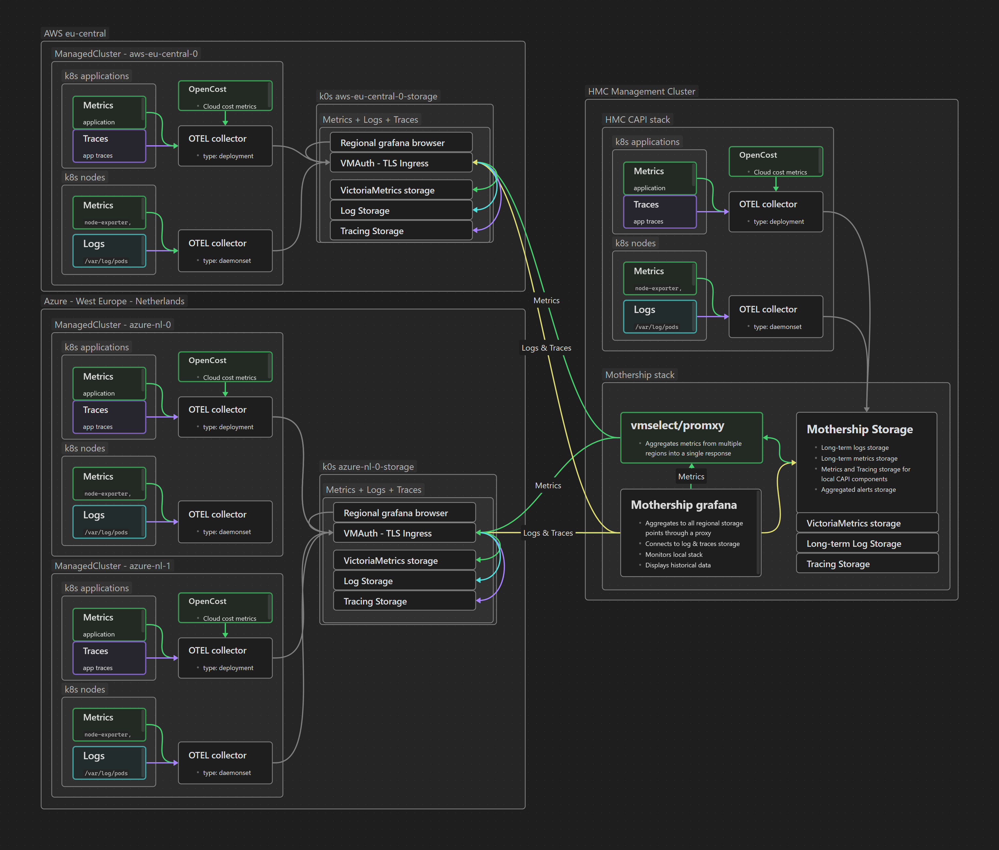
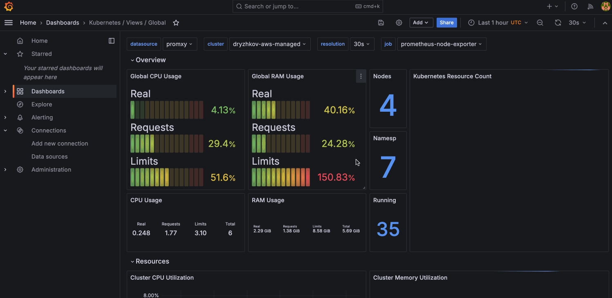

# k0rdent Observability and FinOps (kof)

## Overview

[kof](https://github.com/k0rdent/kof) provides enterprise-grade observability
and FinOps capabilities for k0rdent-managed Kubernetes clusters.
It enables centralized metrics, logging, and cost management
through a unified OpenTelemetry-based architecture.

## Architecture

### High-level

3 layers: Management, Storage, Collection.

```
           ┌────────────────┐
           │   Management   │
           │   UI, promxy   │
           └────────┬───────┘
                    │
             ┌──────┴──────┐
             │             │
        ┌────┴─────┐ ┌─────┴────┐
        │ Storage  │ │ Storage  │
        │ region 1 │ │ region 2 │
        └────┬─────┘ └─────┬────┘
             │             │
      ┌──────┴──────┐     ...
      │             │
┌─────┴─────┐ ┌─────┴─────┐
│ Collect   │ │ Collect   │
│ managed 1 │ │ managed 2 │
└───────────┘ └───────────┘
```

### Mid-level

Data flows up - from observed resources to centralized Grafana:

```
management cluster_____________________
│                                     │
│  kof-mothership chart_____________  │
│  │                               │  │
│  │ centralized Grafana & storage │  │
│  │                               │  │
│  │ promxy                        │  │
│  │_______________________________│  │
│_____________________________________│


cloud 1...
│
│  region 1__________________________________________  region 2...
│  │                                                │  │
.  │  storage cluster_____________________          │  │
.  │  │                                  │          │  │
.  │  │  kof-storage chart_____________  │          │  .
   │  │  │                            │  │          │  .
   │  │  │ regional Grafana & storage │  │          │  .
   │  │  │____________________________│  │          │
   │  │__________________________________│          │
   │                                                │
   │                                                │
   │  managed cluster 1_____________________  2...  │
   │  │                                    │  │     │
   │  │  kof-operators chart_____________  │  │     │
   │  │  │                              │  │  │     │
   │  │  │  opentelemetry-operator____  │  │  .     │
   │  │  │  │                        │  │  │  .     │
   │  │  │  │ OpenTelemetryCollector │  │  │  .     │
   │  │  │  │________________________│  │  │        │
   │  │  │                              │  │        │
   │  │  │  prometheus-operator-crds    │  │        │
   │  │  │______________________________│  │        │
   │  │                                    │        │
   │  │                                    │        │
   │  │  kof-collectors chart________      │        │
   │  │  │                          │      │        │
   │  │  │ opencost                 │      │        │
   │  │  │ kube-state-metrics       │      │        │
   │  │  │ prometheus-node-exporter │      │        │
   │  │  │__________________________│      │        │
   │  │                                    │        │
   │  │                                    │        │
   │  │  observed resources                │        │
   │  │____________________________________│        │
   │________________________________________________│
```

### Low-level



## Helm Charts

### kof-mothership

- Centralized [Grafana](https://grafana.com/) dashboard, managed by [grafana-operator](https://github.com/grafana/grafana-operator)
- Local [VictoriaMetrics](https://victoriametrics.com/) storage for alerting rules only, managed by [victoria-metrics-operator](https://docs.victoriametrics.com/operator/)
- [Sveltos](https://projectsveltos.github.io/sveltos/) dashboard, automatic secret distribution
- [cluster-api-visualizer](https://github.com/Jont828/cluster-api-visualizer) for insight into multicluster configuration
- [k0rdent](https://github.com/k0rdent) service templates to deploy other charts to regional clusters
- [Promxy](https://github.com/jacksontj/promxy) for aggregating Prometheus metrics from regional clusters

### kof-storage

- Regional [Grafana](https://grafana.com/) dashboard, managed by [grafana-operator](https://github.com/grafana/grafana-operator)
- Regional [VictoriaMetrics](https://victoriametrics.com/) storage with main data, managed by [victoria-metrics-operator](https://docs.victoriametrics.com/operator/)
  - [vmauth](https://docs.victoriametrics.com/vmauth/) entrypoint proxy for VictoriaMetrics components
  - [vmcluster](https://docs.victoriametrics.com/operator/resources/vmcluster/) for high-available fault-tolerant version of VictoriaMetrics database
  - [victoria-logs-single](https://github.com/VictoriaMetrics/helm-charts/tree/master/charts/victoria-logs-single) for high-performance, cost-effective, scalable logs storage
- [external-dns](https://github.com/kubernetes-sigs/external-dns) to communicate with other clusters

### kof-operators

- [prometheus-operator-crds](https://github.com/prometheus-community/helm-charts/tree/main/charts/prometheus-operator-crds) Prometheus CRDs required to create OpenTelemetry collectors
- [OpenTelemetry](https://opentelemetry.io/) [collectors](https://opentelemetry.io/docs/collector/) below, managed by [opentelemetry-operator](https://opentelemetry.io/docs/kubernetes/operator/)

### kof-collectors

- [prometheus-node-exporter](https://prometheus.io/docs/guides/node-exporter/) for hardware and OS metrics
- [kube-state-metrics](https://github.com/kubernetes/kube-state-metrics) (KSM) for metrics about the state of Kubernetes objects
- [OpenCost](https://www.opencost.io/) "shines a light into the black box of Kubernetes spend"

## Demo

### Grafana



### Sveltos


## Implementation Guide

!!! WORK IN PROGRESS !!!

### Prerequisites

- k0rdent management cluster
- Infrastructure provider credentials
- Domain for service endpoints
- cert-manager for SSL certificates
- ingress-nginx controller

### 1. Storage Cluster Deployment

``` yaml
apiVersion: kcm.mirantis.com/v1alpha1
kind: ClusterDeployment
metadata:
  name: kof-storage-cluster
  namespace: kof
spec:
  template: kof-storage
  config:
    ingress:
      vmauth:
        host: vmauth.storage.example.com
      grafana:
        host: grafana.storage.example.com
    retention:
      metrics: 30d
      logs: 14d
    storage:
      class: standard
      size: 100Gi
```

### 2. Collector Deployment

``` yaml
apiVersion: kcm.mirantis.com/v1alpha1
kind: ClusterDeployment
metadata:
  name: kof-collector
  namespace: kof
spec:
  template: kof-collectors
  config:
    storage:
      endpoint: vmauth.storage.example.com
    collection:
      logLevel: info
      metrics:
        scrapeInterval: 30s
      logs:
        excludePaths: 
          - /var/log/lastlog
          - /var/log/tallylog
```

### 3. Access Configuration

#### Grafana Setup

1.  Retrieve access credentials:

``` bash
kubectl get secret -n kof grafana-admin-credentials -o jsonpath="{.data.GF_SECURITY_ADMIN_USER}" | base64 -d
kubectl get secret -n kof grafana-admin-credentials -o jsonpath="{.data.GF_SECURITY_ADMIN_PASSWORD}" | base64 -d
```

2.  Configure data sources:

``` yaml
apiVersion: grafana.integreatly.org/v1beta1
kind: GrafanaDatasource
metadata:
  name: metrics
spec:
  name: VictoriaMetrics
  type: prometheus
  access: proxy
  url: http://vmcluster-vmselect.victoria-metrics:8481/select/0/prometheus
```

## Dashboard Organization

- Login to <http://127.0.0.1:3000/dashboards> with user/pass printed above.

- Open a dashboard.

  <figure>
  
  <figcaption
  aria-hidden="true">Pastedimage20250122181247.png</figcaption>
  </figure>

### 1. Cluster Overview

- Health metrics
- Resource utilization
- Performance trends
- Cost analysis

### 2. Logging Interface

- Real-time log streaming
- Full-text search
- Log aggregation
- Alert correlation

### 3. Cost Management

- Resource cost tracking
- Usage analysis
- Budget monitoring
- Optimization recommendations

## Scaling Guidelines

### Regional Expansion

1.  Deploy storage clusters in new regions
2.  Update Promxy configuration
3.  Configure collector routing

### Cluster Addition

1.  Apply collector template
2.  Verify data flow
3.  Configure custom dashboards

## Maintenance

### Backup Requirements

- Grafana configurations
- Alert definitions
- Custom dashboards
- Retention policies

### Health Monitoring

``` bash
# Check collector status
kubectl get pods -n opentelemetry-system

# Verify storage components  
kubectl get pods -n victoria-metrics

# Monitor Grafana
kubectl get pods -n grafana-system
```

## Resource Limits

### Storage Clusters

``` yaml
resources:
  vmcluster:
    limits:
      cpu: 4
      memory: 8Gi
    requests:
      cpu: 2
      memory: 4Gi
```

### Collectors

``` yaml
resources:
  collector:
    limits:
      cpu: 1
      memory: 1Gi
    requests:
      cpu: 200m
      memory: 512Mi
```

## Version Compatibility

| Component       | Version  | Notes                         |
|-----------------|----------|-------------------------------|
| k0rdent         | ≥ 1.0.0  | Required for template support |
| Kubernetes      | ≥ 1.24   | Earlier versions untested     |
| OpenTelemetry   | ≥ 0.81.0 | Recommended minimum           |
| VictoriaMetrics | ≥ 1.91.0 | Required for clustering       |
